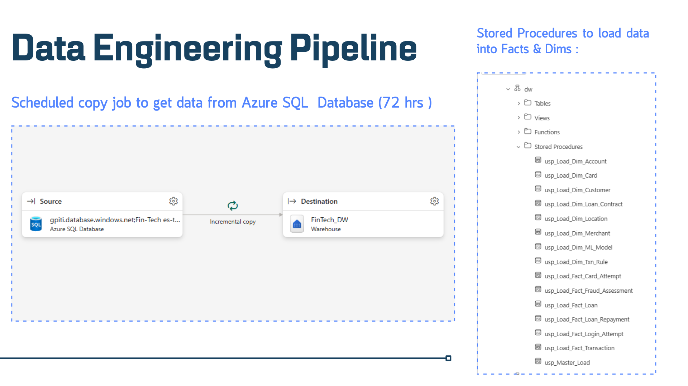
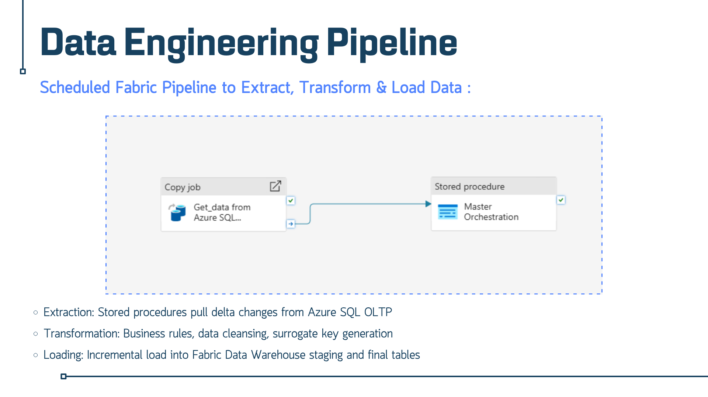
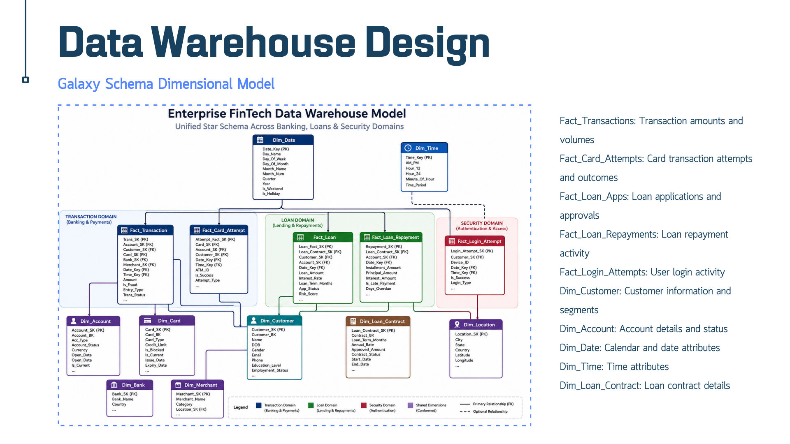

# Data Pipeline

A scheduled **Microsoft Fabric Data Pipeline** that extracts data from the Azure SQL OLTP database and loads it into the Fabric Data Warehouse (`FinTech_DW`) using incremental loading.

### Flow

```
Azure SQL Database ──► Copy job (incremental) ──► FinTech_DW (staging) ──► Master Orchestration ──► Facts & Dims
```

### 1. Incremental Copy Job

A scheduled copy job reads changes from the Azure SQL database and writes them to the warehouse.



| Setting | Value |
|---------|-------|
| Source | Azure SQL Database (`Fin-Tech`) |
| Destination | Fabric Warehouse `FinTech_DW` |
| Mode | Incremental copy |
| Schedule | Every 72 hours (current configuration) |

### 2. Pipeline Orchestration

The pipeline chains the copy job to a stored procedure that runs the whole transformation.



| Step | Activity type | Description |
|------|---------------|-------------|
| 1 | **Copy job** (`Get_data from Azure SQL…`) | Pulls delta changes from the OLTP database |
| 2 | **Stored procedure** (`Master Orchestration`) | Runs `usp_Master_Load`, which loads all dimensions and facts. Runs only if step 1 succeeds. |

### 3. ETL Logic

| Stage | What happens |
|-------|--------------|
| **Extract** | Delta changes are pulled from Azure SQL OLTP |
| **Transform** | Business rules, data cleansing, surrogate key generation |
| **Load** | Incremental load into warehouse staging and final tables (schema `dw`) |

### 4. Load Stored Procedures


| Type | Procedures |
|------|-----------|
| Dimensions | `usp_Load_Dim_Account`, `usp_Load_Dim_Card`, `usp_Load_Dim_Customer`, `usp_Load_Dim_Loan_Contract`, `usp_Load_Dim_Location`, `usp_Load_Dim_Merchant`, `usp_Load_Dim_ML_Model`, `usp_Load_Dim_Txn_Rule` |
| Facts | `usp_Load_Fact_Card_Attempt`, `usp_Load_Fact_Fraud_Assessment`, `usp_Load_Fact_Loan`, `usp_Load_Fact_Loan_Repayment`, `usp_Load_Fact_Login_Attempt`, `usp_Load_Fact_Transaction` |
| Master | `usp_Master_Load` (calls the dimension loads first, then the facts) |

> Dimensions should load before facts so that surrogate keys exist when facts are resolved.

### Setup

1. Create a Fabric workspace and the `FinTech_DW` warehouse (see [Data Warehouse](../data-warehouse)).
2. Create the load stored procedures in the `dw` schema.
3. In Fabric, create a **Data Pipeline**:
   - Add a **Copy job** activity (Azure SQL → `FinTech_DW`, incremental).
   - Add a **Stored procedure** activity calling `dw.usp_Master_Load`, connected on success.
4. Set the schedule (currently 72 hours) and run once manually.
5. Check the run in **Monitor** and verify row counts in the warehouse.

### Monitoring & Troubleshooting

- Use Fabric **Monitor** to see run history, duration, and failures.
- If the copy succeeds but the loads fail, check the stored procedure output and any staging-table mismatches.
- Re-running is safe when loads are incremental, but check for duplicate keys on the first full load.


# Data Warehouse

`FinTech_DW` is a **Microsoft Fabric Data Warehouse** modeled as a **galaxy schema** (multiple fact tables sharing conformed dimensions) across three business domains. It serves the Power BI dashboards and the RAG AI assistant (natural language → T-SQL).

## Dimensional Model



Objects live in the `dw` schema: `dw.Fact_*` and `dw.Dim_*`.

## Domains and Fact Tables

| Domain | Fact table | Description | Key measures / attributes |
|--------|-----------|-------------|---------------------------|
| Banking & Payments | `Fact_Transaction` | Transaction amounts and volumes | `Amount`, `Entry_Type`, `Trans_Status`, `Is_Fraud` |
| Banking & Payments | `Fact_Card_Attempt` | Card transaction attempts and outcomes | `Is_Success`, `Attempt_Type`, `ATM_ID` |
| Lending & Repayments | `Fact_Loan` | Loan applications and approvals | `Loan_Amount`, `Interest_Rate`, `Loan_Term_Months`, `App_Status`, `Risk_Score` |
| Lending & Repayments | `Fact_Loan_Repayment` | Loan repayment activity | `Installment_Amount`, `Principal_Amount`, `Interest_Amount`, `Is_Late_Payment`, `Days_Overdue` |
| Security | `Fact_Login_Attempt` | User login activity | `Is_Success`, `Login_Type`, `Device_ID` |
| Fraud (loaded by procedure) | `Fact_Fraud_Assessment` | Fraud scoring results | Loaded by `usp_Load_Fact_Fraud_Assessment` |

## Dimensions

| Dimension | Description | Used by |
|-----------|-------------|---------|
| `Dim_Customer` | Customer information and segments (demographics, employment, income, liability) | All facts |
| `Dim_Account` | Account details and status | Transactions, cards, loans, repayments |
| `Dim_Card` | Card type, credit limit, blocked flag | Transactions, card attempts |
| `Dim_Bank` | Bank name and country | Transactions |
| `Dim_Merchant` | Merchant name, category, location | Transactions |
| `Dim_Loan_Contract` | Loan contract details (rate, term, amount, status, dates) | Loans, repayments |
| `Dim_Location` | City, state, country, latitude/longitude | Customers, merchants, logins |
| `Dim_Date` | Calendar attributes (day, month, quarter, year, weekend/holiday flags) | All facts |
| `Dim_Time` | Time attributes (12/24-hour, AM/PM, time period) | Transactions, card attempts, logins |
| `Dim_ML_Model` | ML model versions | Loan / fraud scoring |
| `Dim_Txn_Rule` | Transaction (fraud) rules | Fraud assessment |

## Design Conventions

- **Surrogate keys** (`*_SK`) on every dimension and fact, generated during the transform step; **business keys** (`*_BK`) keep the link to the OLTP source.
- **Conformed dimensions:** `Dim_Customer`, `Dim_Account`, `Dim_Date`, and others are shared across domains, so users can analyse across banking, lending, and security.
- **History tracking:** dimensions such as `Dim_Customer`, `Dim_Account`, and `Dim_Card` carry `Effective_Date`, `Expiry_Date`, and `Is_Current` columns (slowly changing dimension pattern), plus `DW_Insert_Date` for auditing.
- **Role-playing dates:** `Fact_Loan` links to `Dim_Date` several times (application date, contract start, contract end).
- **Incremental loading:** loaded by the [Data Pipeline](../data-pipeline) via `usp_Master_Load`.

## Scale

The RAG architecture reports about **131 million rows** across the warehouse, which is why the fact tables use a star layout for fast aggregation.

## Consumers

| Consumer | How it uses the warehouse |
|----------|--------------------------|
| Power BI dashboards | Semantic models over the facts and dimensions (login, transactions, loans) |
| RAG AI Assistant | LLM-generated T-SQL runs against `dw.*` tables, validated against the schema first |
| ML | Historical features for risk modeling |

## Example Query

```sql
-- Total transaction amount per month
SELECT D.Month_Name, SUM(T.Amount) AS Total_Txn_Amount
FROM dw.Fact_Transaction T
JOIN dw.Dim_Date D ON T.Date_Key = D.Date_Key
GROUP BY D.Month_Name;
```

## Setup

1. In Fabric, create a **Warehouse** named `FinTech_DW`.
2. Run the DDL to create the `dw` schema, dimensions, then facts.
3. Create the `usp_Load_*` procedures and `usp_Master_Load`.
4. Run the [Data Pipeline](../data-pipeline) to populate the warehouse.
5. Validate: compare row counts and totals between the OLTP source and the warehouse.
