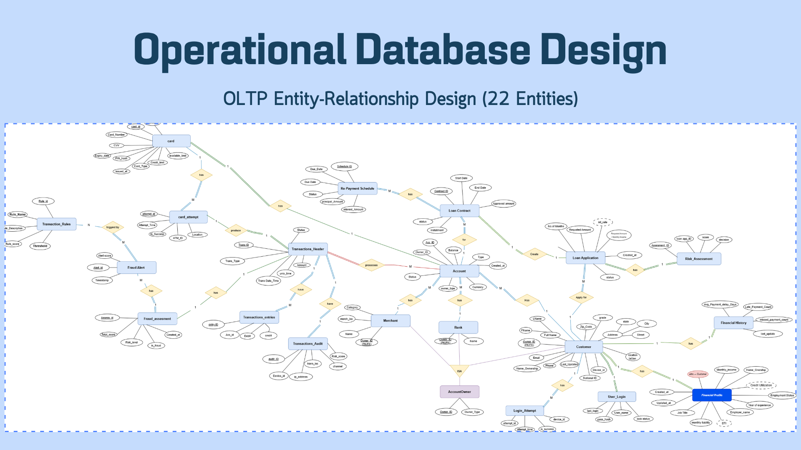
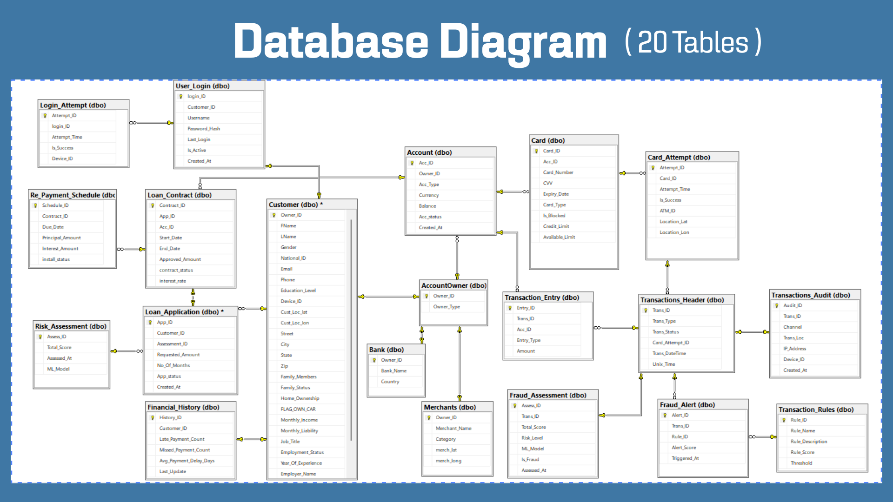
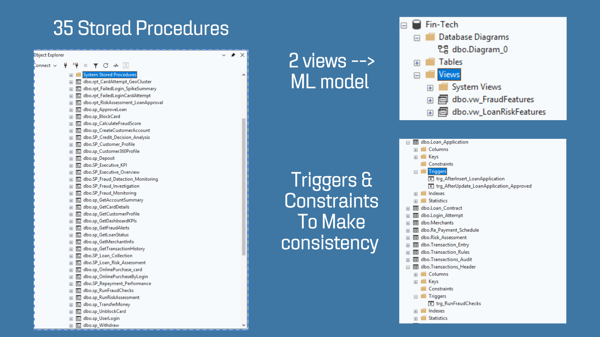

# 01 · OLTP Operational Database

The operational banking database, hosted on **Azure SQL Database**, that captures all customer, account, card, transaction, fraud, and loan activity. It is the source system for the Fabric data pipeline, the Power Apps front-end, the ML feature views, and the SSRS operational reports.

## Overview

| Item | Value |
|------|-------|
| Database name | `Fin-Tech` |
| Platform | Azure SQL Database (Standard S0, 10 DTUs) |
| Region | UAE North |
| ER design | 22 entities |
| Physical tables | 20 |
| Stored procedures | 35 |
| Views | 2 (feed the ML models) |
| Triggers | Yes, for consistency and fraud checks |

---

## 1. Entity-Relationship Design (22 Entities)

The conceptual model covers customers, accounts, cards, transactions, fraud detection, and the full loan lifecycle.



## 2. Database Diagram (20 Tables)

The physical implementation in SQL Server, with primary/foreign keys.


Database Implementation/Screenshots/Database  diagram.png
### Tables by domain

| Domain | Tables |
|--------|--------|
| Customers & access | `Customer`, `User_Login`, `Login_Attempt`, `Financial_History` |
| Accounts & cards | `Account`, `AccountOwner`, `Bank`, `Merchants`, `Card`, `Card_Attempt` |
| Transactions & fraud | `Transactions_Header`, `Transaction_Entry`, `Transactions_Audit`, `Fraud_Assessment`, `Fraud_Alert`, `Transaction_Rules` |
| Lending | `Loan_Application`, `Loan_Contract`, `Re_Payment_Schedule`, `Risk_Assessment` |

### Design notes

- **Transaction model:** each transaction has a header (`Transactions_Header`), one or more entries (`Transaction_Entry`, credit/debit), and an audit record (`Transactions_Audit`: channel, IP address, device).
- **Fraud model:** `Transaction_Rules` define scoring rules; `Fraud_Assessment` stores the score and risk level per transaction; `Fraud_Alert` records triggered rules.
- **Loan model:** `Loan_Application` → `Risk_Assessment` (ML score) → `Loan_Contract` → `Re_Payment_Schedule` (installments).
- **Security:** `User_Login` stores `Password_Hash` (never plain-text passwords); `Login_Attempt` tracks device and success for spike/fraud analysis.

---

## 3. Stored Procedures, Views, Triggers & Constraints
Database Implementation/Screenshots/SPs_Views _Triggers.png


### Stored procedures (35)

- **Customer & account:** `sp_CreateCustomerAccount`, `sp_GetCustomerProfile`, `sp_Customer360Profile`, `sp_GetAccountSummary`, `sp_UserLogin`
- **Money movement:** `sp_Deposit`, `sp_Withdraw`, `sp_TransferMoney`, `sp_OnlinePurchase_card`, `sp_OnlinePurchaseByLogin`
- **Cards:** `sp_BlockCard`, `sp_UnblockCard`, `sp_GetCardDetails`
- **Fraud:** `sp_CalculateFraudScore`, `sp_RunFraudChecks`, `SP_Fraud_Detection_Monitoring`, `SP_Fraud_Investigation`, `SP_Fraud_Monitoring`, `sp_GetFraudAlerts`
- **Loans & risk:** `sp_ApproveLoan`, `sp_RunRiskAssessment`, `SP_Loan_Risk_Assessment`, `SP_Credit_Decision_Analysis`, `SP_Loan_Collection`, `SP_Repayment_Performance`, `sp_GetLoanStatus`
- **Reporting / KPIs:** `SP_Executive_KPI`, `SP_Executive_Overview`, `sp_GetDashboardKPIs`, `rpt_*` procedures (card-attempt geo-cluster, failed-login spike summary, risk assessment / loan approval)

### Views (ML feature sources)

| View | Used by |
|------|---------|
| `vw_FraudFeatures` | Fraud model features |
| `vw_LoanRiskFeatures` | Loan risk model features |

### Triggers

| Trigger | Table | Purpose |
|---------|-------|---------|
| `trg_AfterInsert_LoanApplication` | `Loan_Application` | Runs logic when a new application is created |
| `trg_AfterUpdate_LoanApplication_Approved` | `Loan_Application` | Runs logic when an application is approved (e.g. contract creation) |
| `trg_RunFraudChecks` | `Transactions_Header` | Runs fraud checks automatically on each new transaction |

Primary/foreign keys and constraints keep the data consistent across all 20 tables.

---

## 4. Azure Deployment


| Setting | Value |
|---------|-------|
| Resource group | `GP` |
| Server | Azure SQL logical server (`*.database.windows.net`) |
| Location | UAE North |
| Pricing tier | Standard S0 (10 DTUs) |
| Subscription | Azure for Students |
| Fabric integration | "Mirror database in Fabric (preview)" available |

> Do not publish the subscription ID, connection strings, or firewall rules in the repo or in screenshots. Blur them before uploading.

---

## Folder Structure

```
01-oltp-database/
├── README.md
├── Screenshots/
│   ├── ERD.png
│   ├── Database diagram.png
│   ├── SPs_Views_Triggers.png
│   └── azure-sql-deployment.png
├── schema/          # CREATE TABLE scripts
├── procedures/      # Stored procedures
├── views/
├── triggers/
└── seed-data/       # Synthetic sample data only
```
