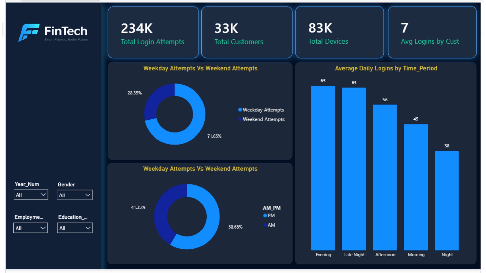
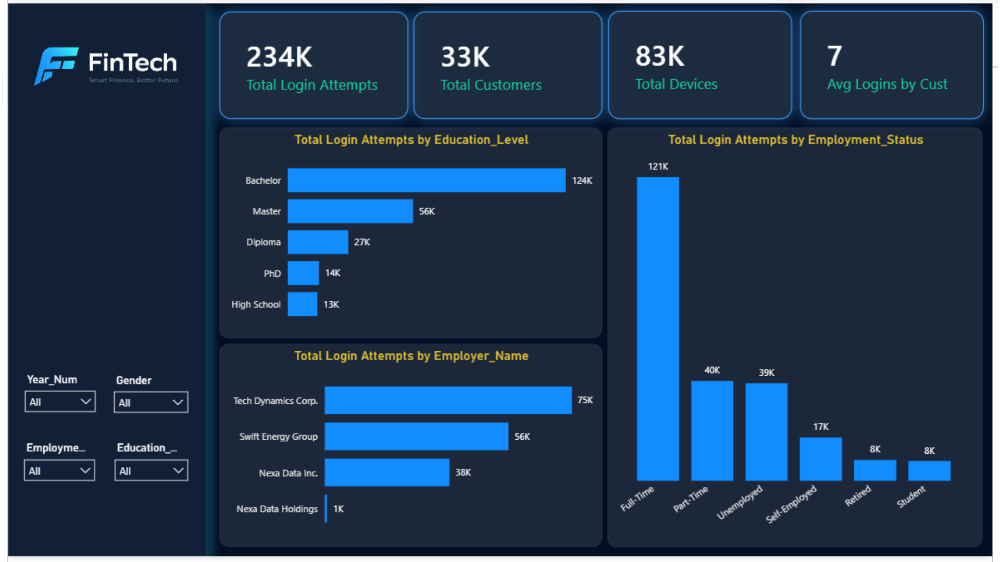
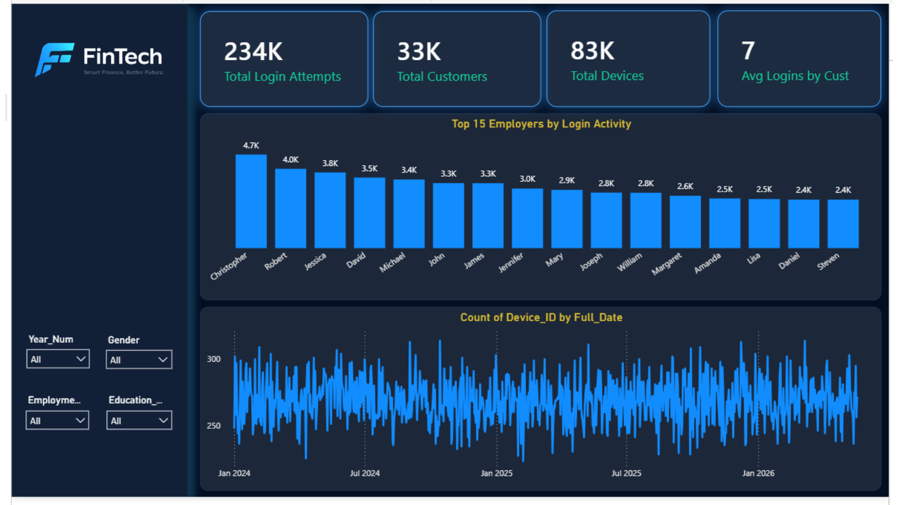
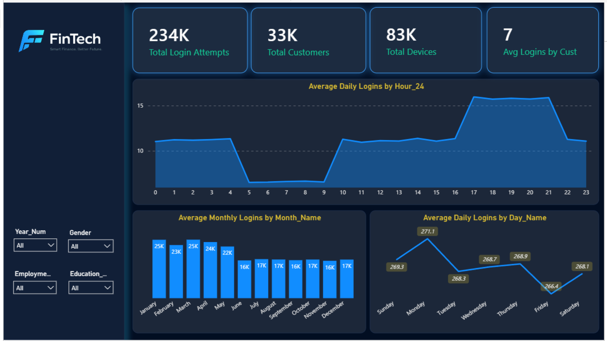

# 1. Dashboard · User Login Analytics

**Business question:** *How, when, and from whom do customers log in, and what does that say about engagement and security risk?*

Part of the **Customer Behavior Analytics** area: segmentation, engagement metrics, and login behavior.

## Semantic Model

| Table | Role |
|-------|------|
| `Fact_Login_Attempt` | One row per login attempt (`Login_Attempt_BK`, `Cust_SK`, `Date_Key`, `Time_Key`, `Device_ID`, `Is_Success`, `Attempt_DateTime`) |
| `Dim_Customer` | Demographics and employment (education, employer, employment status, income, liability, etc.) |
| `Dim_Date` | Calendar attributes (day, month, weekend/holiday flags) |
| `Dim_Time` | Hour (12/24), AM/PM, time period |
| `Measure` | Table holding all DAX measures |

**Relationships:** `Dim_Customer` (1) → `Fact_Login_Attempt` (*); `Dim_Date` (1) → fact (*); `Dim_Time` (1) → fact (*).

## Pages

### Page 1: Login Trends Over Time

### Page 2: Time-of-Day and Weekday Patterns

### Page 3: Customer Segments

### Page 4: Employers and Device Activity

## Measures

| Measure | Purpose |
|---------|---------|
| Total Login Attempts | Count of login attempts |
| Total Customers | Distinct customers who logged in |
| Total Devices | Distinct devices used |
| Average Attempts Per Customer | Attempts ÷ customers |
| Average Logins by Customer | Avg logins per customer |
| Average Logins by Employment Status | Avg logins per employment segment |
| Average Daily Logins | Attempts ÷ days |
| Average Monthly Logins | Attempts ÷ months |
| Peak Login Hour | Hour with the highest activity |
| Weekday Attempts / Weekend Attempts | Attempts split by `Is_Weekend` |
| Missing Dates | Days with no activity (data completeness check) |

> TODO: add the exact DAX for each measure in `dax-measures.md`.

## Slicers

`Year_Num` · `Gender` · `Employment_Status` · `Education_Level`

## Key Insights

- Login activity peaks in the evening (17:00–21:00) and drops overnight/early morning.
- Roughly 7 in 10 attempts happen on weekdays.
- Volume fell after May, from about 22K–25K to about 16K–17K per month.
- Bachelor-degree and full-time customers generate the most activity.
