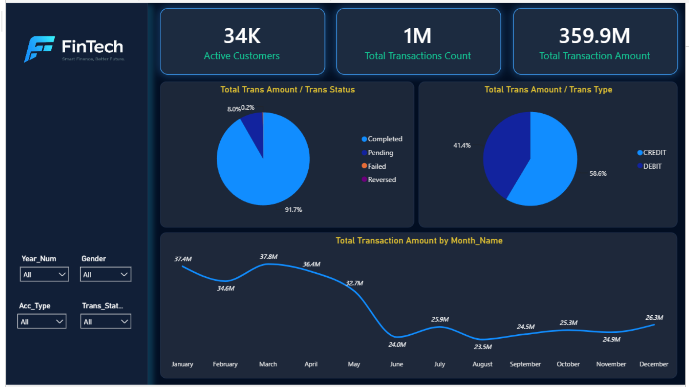
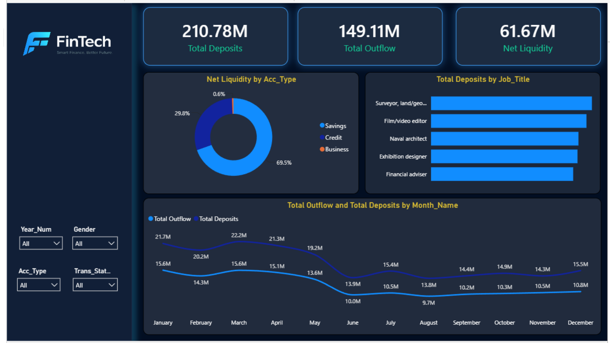
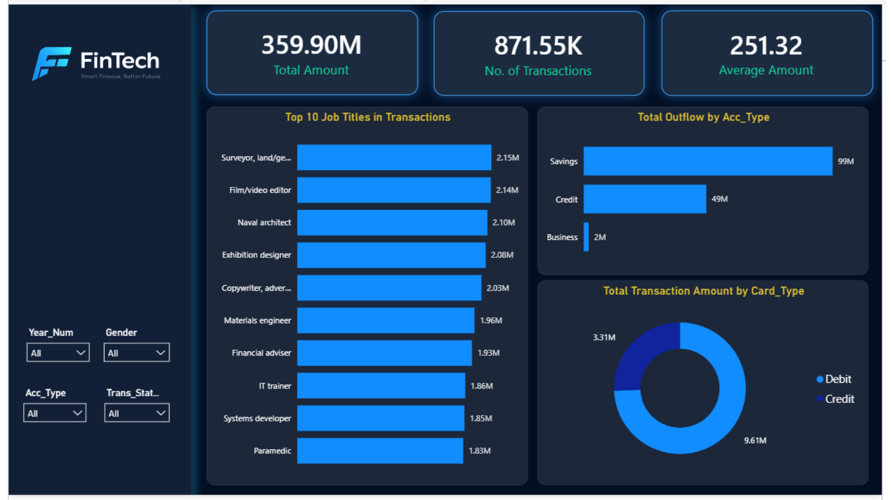
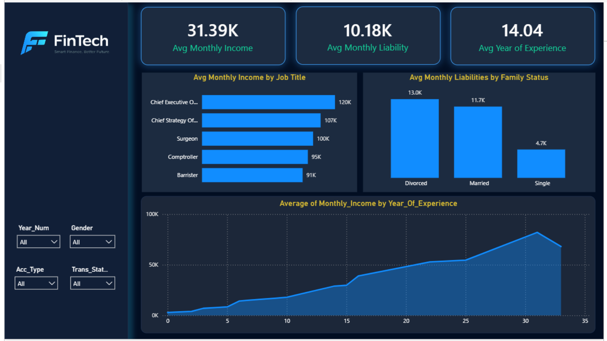
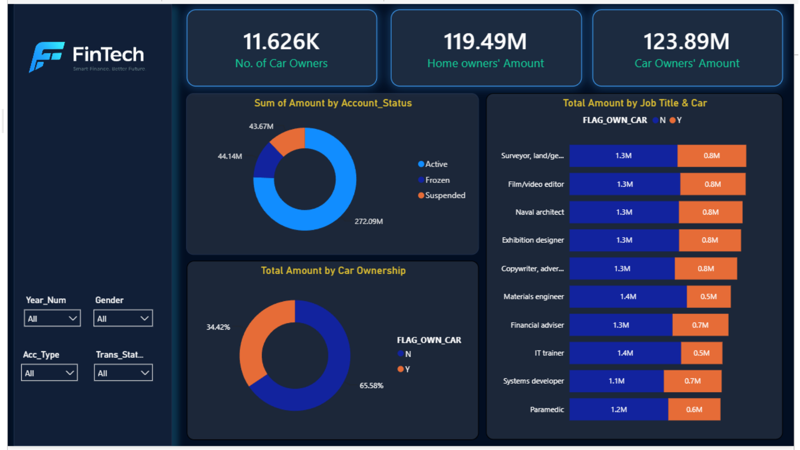
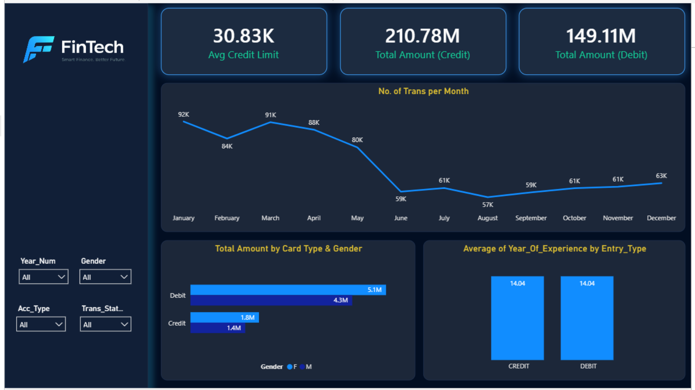
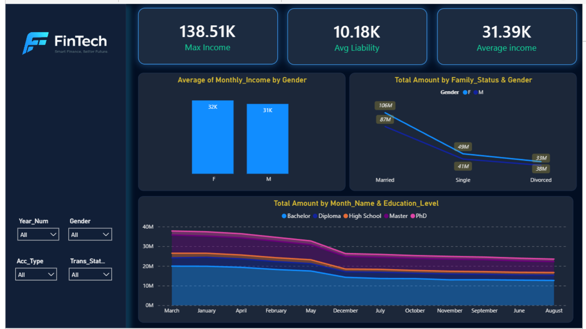
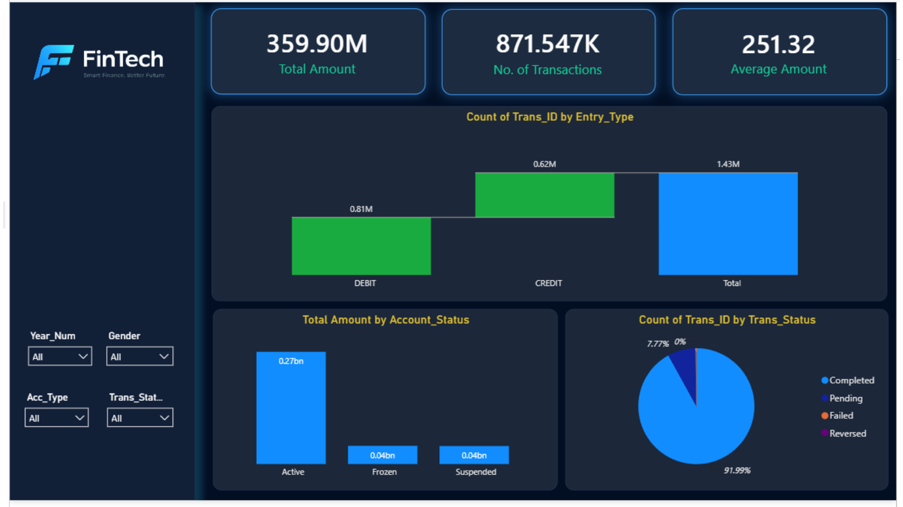
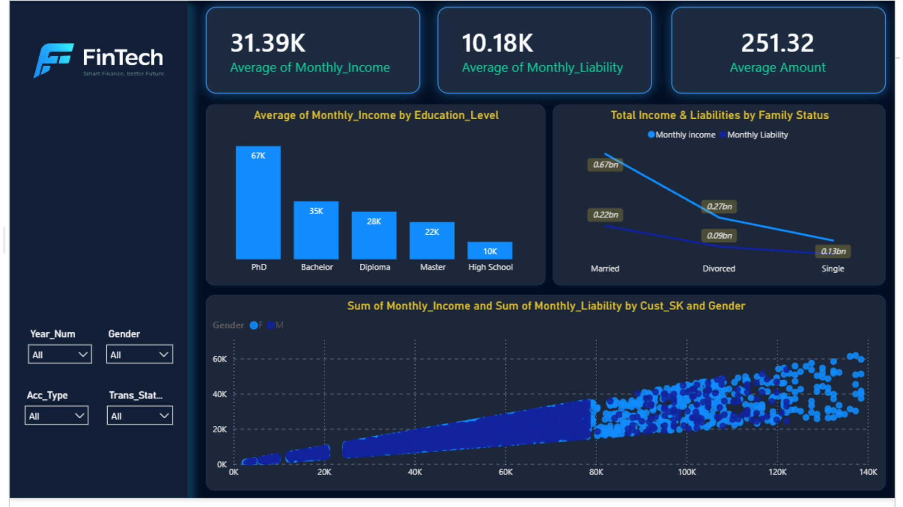

# 2. Dashboard · Transaction Analytics

**Business question:** *How much money moves through the bank, through which channels, accounts, and customer segments, and how healthy is liquidity?*

Covers **volume trends, channel analysis, and anomaly detection**.

## Semantic Model

| Table | Role |
|-------|------|
| `Fact_Transaction` | Transaction entries: amount, entry type (credit/debit), status, fraud flag, keys to customer, account, card, bank, merchant, date |
| `Fact_Card_Attempt` | Card attempts and success flag |
| `Dim_Customer` | Demographics, job, income, liability, family status, car/home ownership |
| `Dim_Account` | Account type, status, balance, currency |
| `Dim_Card` | Card type, credit limit, blocked flag |
| `Dim_Bank`, `Dim_Merchant`, `Dim_Location` | Bank, merchant, and geography context |
| `Dim_Date` | Calendar attributes |
| `Dax Measures` | Measure table |

## PAGES: 

### Page 1: Transaction Overview

### Page 2: Liquidity
  

### Page 3: Job Titles and Channels
  

### Page 4: Income and Liabilities
  

### Page 5: Ownership and Account Status
  

### Page 6: Card Behavior
  

### Page 7: Gender, Family and Education
  

### Page 8: Entry Types and Status Mix
  

### Page 9: Income vs Liability
  

## Measures

| Measure | Purpose |
|---------|---------|
| Total Transaction Amount | Sum of transaction amounts |
| Successful Transactions Count | Count of completed transactions |
| Success Rate % | Successful ÷ total |
| Active Customers | Distinct customers with transactions |
| Total Deposits | Sum of credit entries |
| Total Outflow | Sum of debit entries |
| Net Liquidity | Deposits − Outflow |
| Outflow Test Search | Helper measure (consider removing or renaming before release) |

> TODO: add exact DAX in `dax-measures.md`.

## Slicers

`Year_Num` · `Gender` · `Acc_Type` · `Trans_Status` (Income/demographic pages use `Year_Num`, `Gender`, `Acc_Type`, `Trans_Status` too)

## Key Insights

- Deposits exceed outflow every month (net liquidity 61.67M).
- Volume declines after May, both in amount and transaction count.
- About 92% of transactions complete; about 8% remain pending.
- Savings accounts hold about 70% of net liquidity.
- Frozen/Suspended accounts still account for about 88M in transaction amount, which is worth a review.

